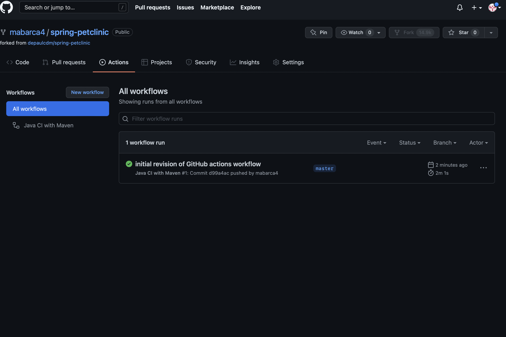
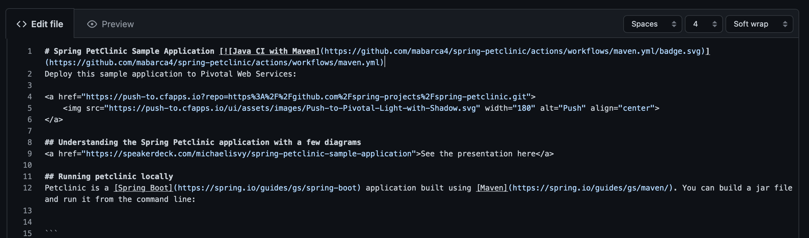
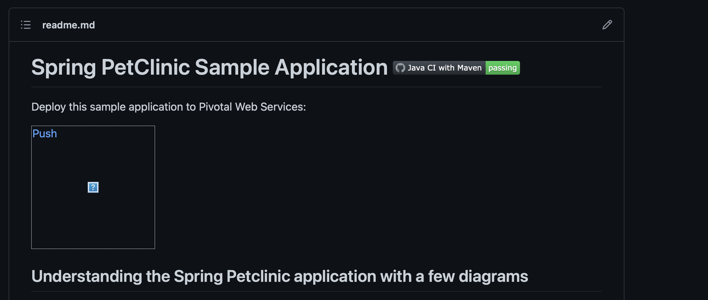
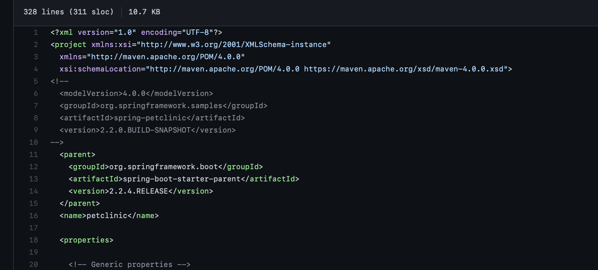
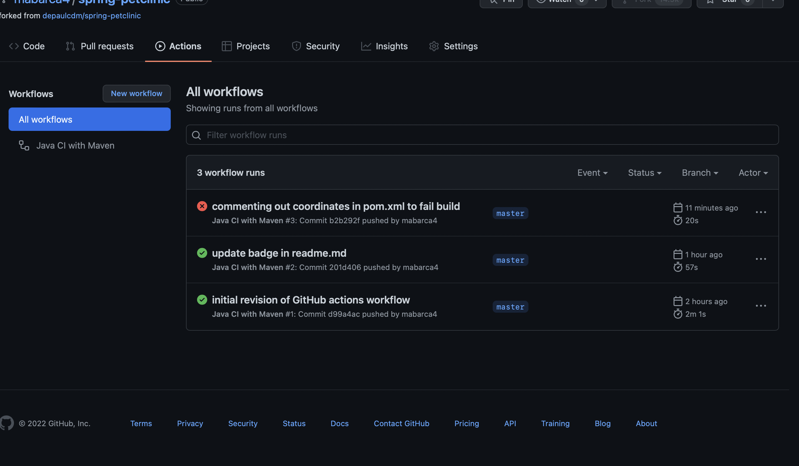
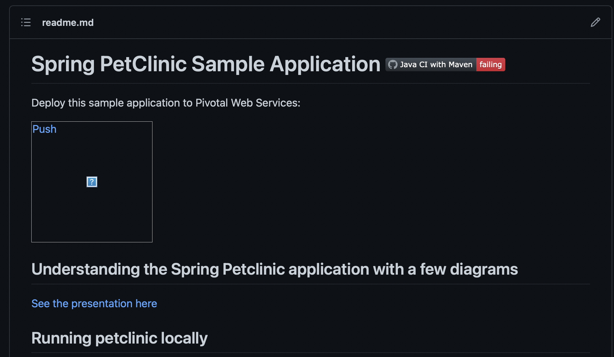
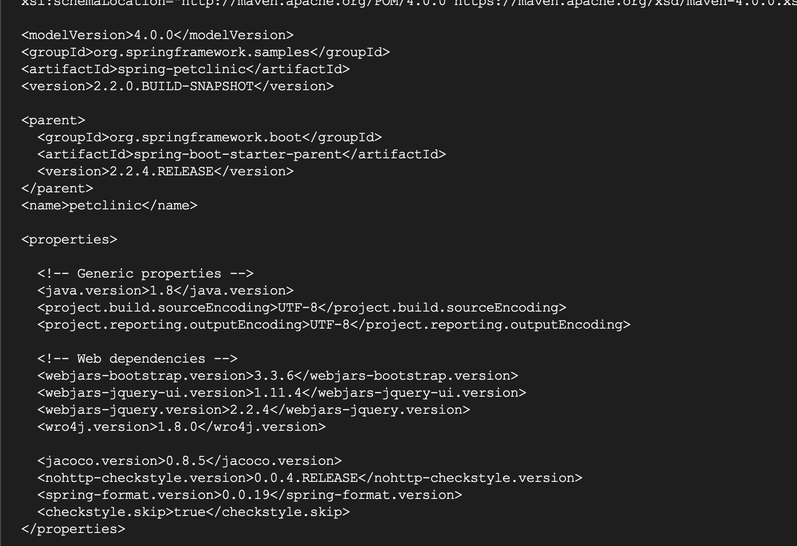
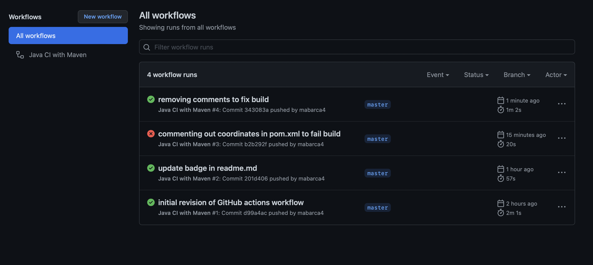
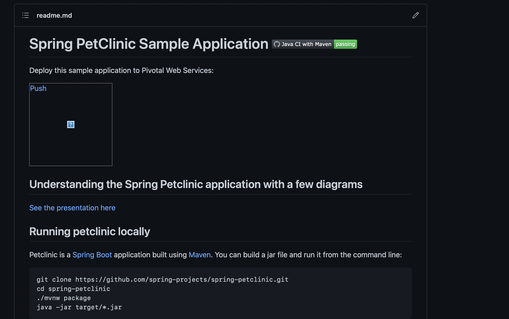
#hw8 additions
https://github.com/mabarca4/spring-petclinic/blob/master/Dockerfile
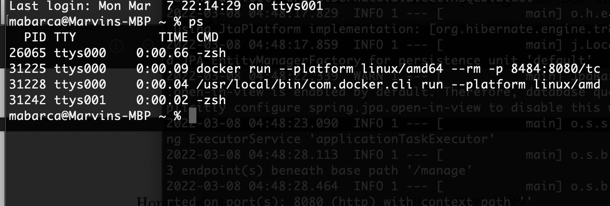
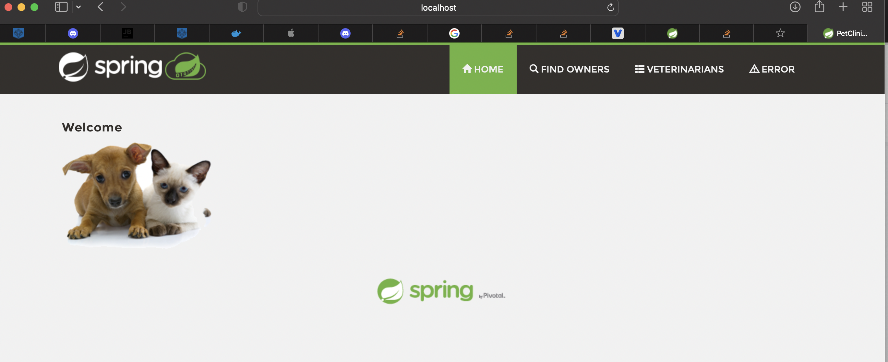
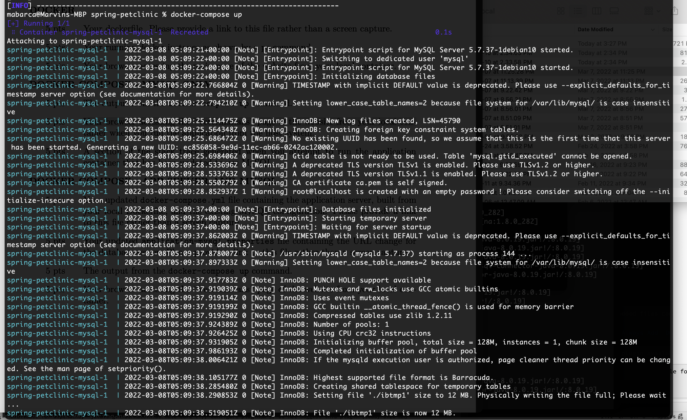
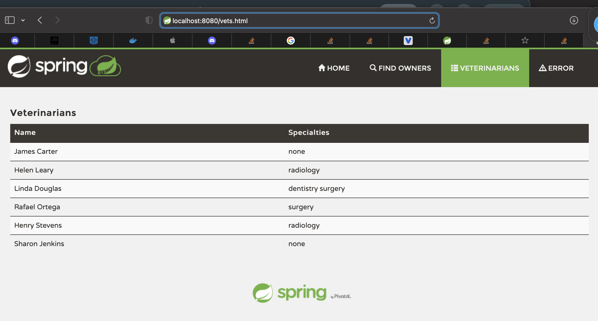
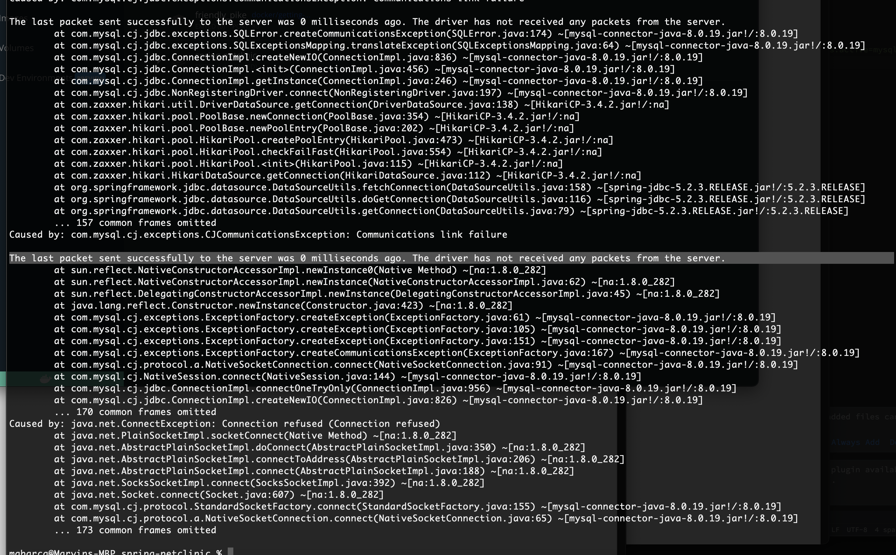
https://github.com/mabarca4/spring-petclinic/blob/master/docker-compose.yml
https://github.com/mabarca4/spring-petclinic/blob/master/src/main/resources/application-mysql.properties
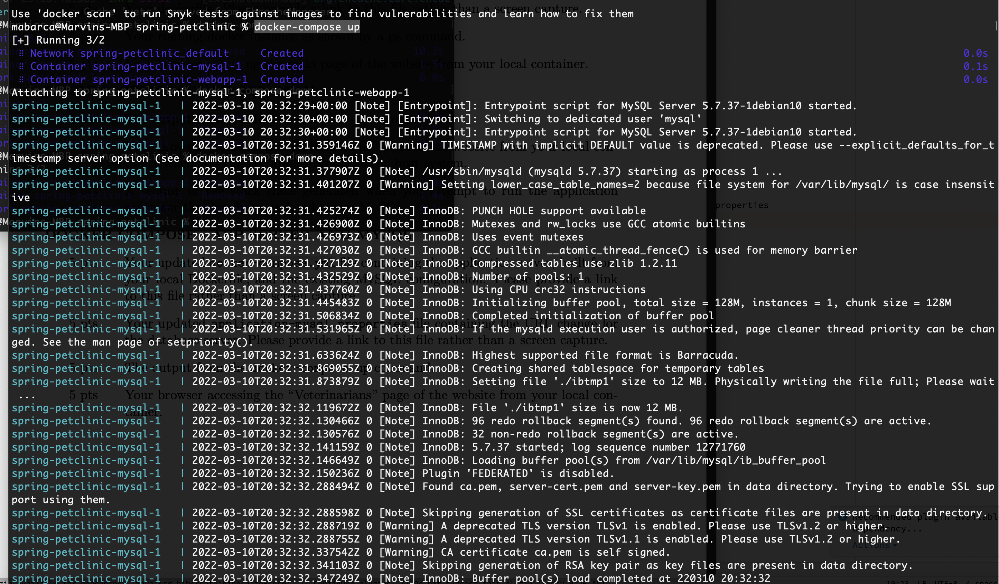
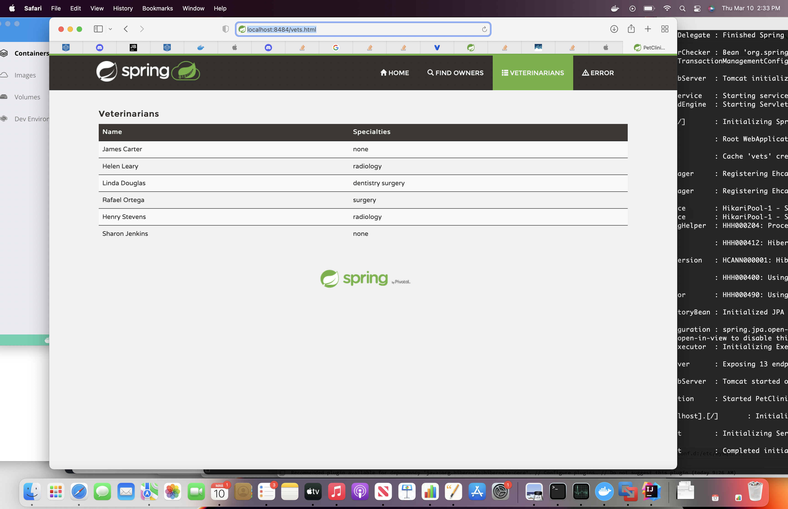
